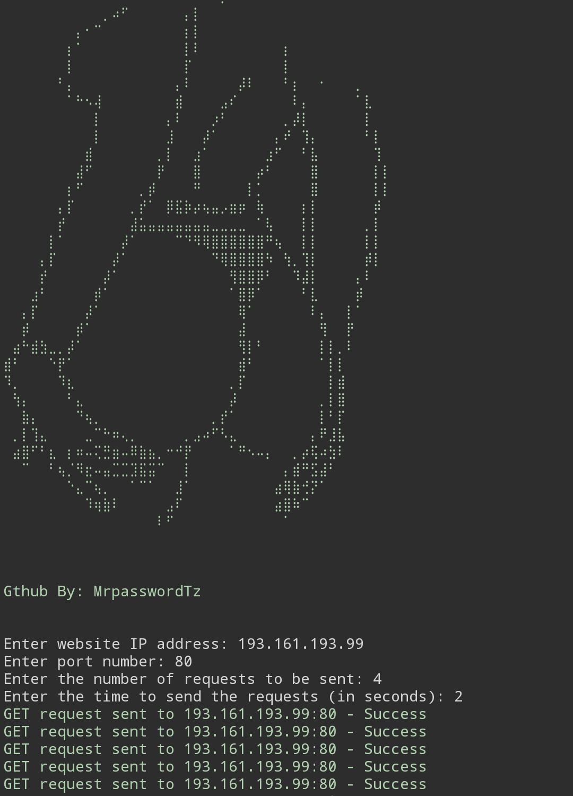

<p align="center">
  <a href="https://www.python.org/">
    
  </a>
</p>

<p align="center">
  <a href="https://github.com/MrpasswordTz/SlowGirl/stargazers">
    
  </a>
  <a href="https://github.com/MrpasswordTz/SlowGirl/issues">
    
  </a>
  
  
  
  
  
</p>


## SlowGirl
slowGirl - A Simple &amp; Automated Web Server DDoS Tool A user-friendly and simple DDoS tool for beginners, made with Python. slowGirl is an automated tool that detects the type of web server (get, post, or head) and supports both Termux and Linux (root and rootless).

## Features
Simple and easy to use, designed for beginners
Made with Python
Automatically detects the type of web server (get, post, or head)
Supports both Termux and Linux (root and rootless).

## Installation in Termux
```bash
pkg update -y && pkg upgrade -y
pkg install wget git
pkg install python
git clone https://github.com/MrpasswordTz/SlowGirl.git
cd slowgirl
pip install -r requirements.txt
python3 slowgirl.py
```
## Installation on Linux
```bash
apt update -y && apt upgrade -y 
git clone https://github.com/MrpasswordTz/SlowGirl.git
cd slowgirl
pip install requirements.txt
python3 slowgirl.py
```
## Disclaimer
This tool is intended for educational purposes only. Misuse of this tool can lead to legal

<h6 style="color:red;">POWERED BY BONGO @BONGOCODERS</h6>
